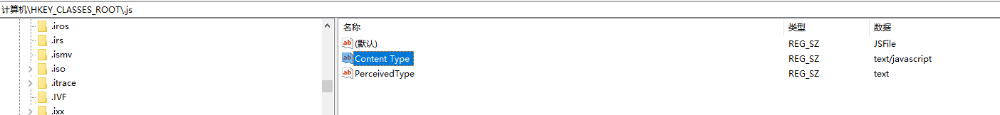

# SQL2NL 演示项目

// TODO ...

### 项目结构

```bash
.
│  .gitignore
│  README.md
│
├─backend # 基于Flask的后端
│  ├─flaskr
│  │  │  predict.py # predict接口蓝图
│  │  │  __init__.py # 工厂初始化Flask app
│  │
│  └─instance # 数据库存储（暂未使用）
└─frontend # 基于Vue的前端
    └─sql2nl-demo
        ├─.vscode
        ├─node_modules
        │  ├─vite
        │  └─vue
        ├─public
        └─src
            ├─assets
            └─components
                └─icons
```


### 构建/运行环境要求

#### backend

1. python >= 3.8.12
2. Flask >= 2.1.1
3. PyTorch 1.8.1

```bash
conda create -n [env_name] python=3.8.12
# activate env
pip install Flask==2.1.1
```

#### frontend

node.js(16.17.0 LTS https://nodejs.org/en/download/)

vue@3.2.37(dependencies:vitejs/plugin-vue@^3.0.1, vite@^3.0.4)

```bash
# ./frontend/
npm install vue@latest
```

项目构建参数参考（不需要重复create-vue）

```bash
√ Project name: ... sql2nl-demo
√ Add TypeScript? ... No / Yes
√ Add JSX Support? ... No / Yes
√ Add Vue Router for Single Page Application development? ... No / Yes
√ Add Pinia for state management? ... No / Yes
√ Add Vitest for Unit Testing? ... No / Yes
√ Add Cypress for both Unit and End-to-End testing? ... No / Yes
√ Add ESLint for code quality? ... No / Yes
```


### 启动命令

先生成frontend内容后启动backend

#### frontend

```bash
# ./frontend/
  cd sql2nl-demo
  npm install
  npm run dev # 开发测试
  npm run build # 部署，生成后将dist内容复制到 ./backend/flaskr/对应目录下
```


#### backend

```bash
# Linux(bash)
# ./backend/
$ export FLASK_APP=flaskr
$ export FLASK_ENV=development
$ flask run --host=0.0.0.0

# windows(cmd)
# ./backend/
> set FLASK_APP=flaskr
> set FLASK_ENV=development
> flask run --host=0.0.0.0
```

注意，windows下启动服务器需要将注册表"[HKEY_CLASSES_ROOT\.js]"对应内容设置为"Content Type"="text/javascript"，否则发送给浏览器的js脚本存在ContentType格式问题




### 参考文档

Flask中文：https://dormousehole.readthedocs.io/en/latest/index.html

Flask快速上手：https://dormousehole.readthedocs.io/en/latest/quickstart.html

Vue官方中文：https://cn.vuejs.org/guide/introduction.html

Vite官方中文：https://cn.vitejs.dev/config/

Python的Web框架Flask + Vue 生成漂亮的词云：https://cloud.tencent.com/developer/article/1592758

使用Flask部署图像分类模型：https://segmentfault.com/a/1190000023319921